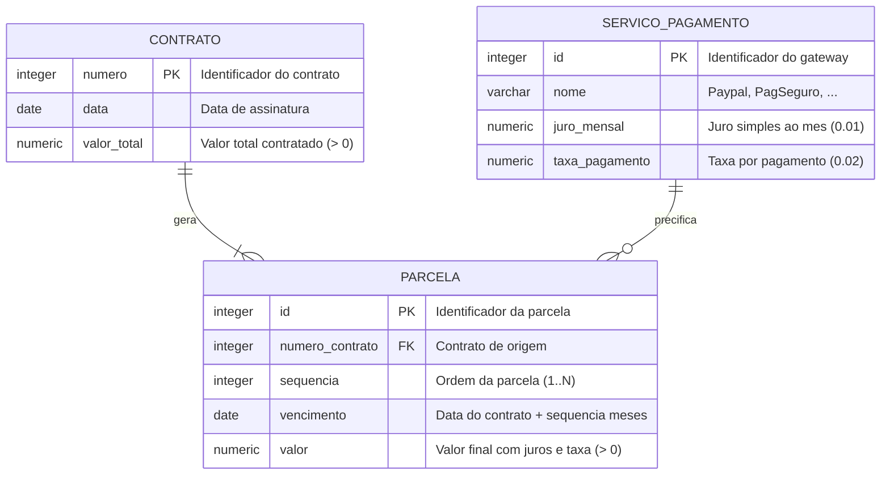

# Diagrama de Entidade e Relacionamento

## Visão conceitual



## Cardinalidades

| Relacionamento | Cardinalidade | Regra |
|---|---|---|
| Contrato → Parcela | 1 : N (N ≥ 1) | Um contrato gera N parcelas; uma parcela pertence a exatamente um contrato |
| Serviço de Pagamento → Parcela | 1 : N (opcional) | O gateway vigente define juro e taxa aplicados no cálculo |

## Entidades

### CONTRATO
Agregado raiz. Concentra os dados informados pelo usuário e é dono do ciclo de vida das parcelas.

| Atributo | Tipo | Restrição |
|---|---|---|
| `numero` | `Integer` | Obrigatório, > 0, único |
| `data` | `LocalDate` | Obrigatória, formato de entrada `dd/MM/yyyy` |
| `valorTotal` | `BigDecimal` | Obrigatório, > 0 |
| `parcelas` | `List<Parcela>` | Coleção interna; exposta como lista imutável |

### PARCELA
Entidade fraca — não existe sem um contrato. Modelada como `record` imutável.

| Atributo | Tipo | Restrição |
|---|---|---|
| `vencimento` | `LocalDate` | Obrigatório |
| `valor` | `BigDecimal` | Obrigatório, > 0, escala 2 |

### SERVICO_PAGAMENTO
Não é persistido no exercício — está no DER porque `juroMensal` e `taxaDePagamento` são dados do gateway, não do contrato. Se amanhã a empresa trocar o Paypal por outro provedor, o que muda é essa linha, não o contrato.

## Modelo relacional equivalente (PostgreSQL)

```sql
CREATE TABLE servico_pagamento (
    id              SERIAL PRIMARY KEY,
    nome            VARCHAR(60)   NOT NULL UNIQUE,
    juro_mensal     NUMERIC(6, 4) NOT NULL CHECK (juro_mensal >= 0),
    taxa_pagamento  NUMERIC(6, 4) NOT NULL CHECK (taxa_pagamento >= 0)
);

CREATE TABLE contrato (
    numero      INTEGER        PRIMARY KEY,
    data        DATE           NOT NULL,
    valor_total NUMERIC(15, 2) NOT NULL CHECK (valor_total > 0)
);

CREATE TABLE parcela (
    id                   BIGSERIAL      PRIMARY KEY,
    numero_contrato      INTEGER        NOT NULL REFERENCES contrato (numero) ON DELETE CASCADE,
    id_servico_pagamento INTEGER        REFERENCES servico_pagamento (id),
    sequencia            INTEGER        NOT NULL CHECK (sequencia > 0),
    vencimento           DATE           NOT NULL,
    valor                NUMERIC(15, 2) NOT NULL CHECK (valor > 0),
    CONSTRAINT uk_parcela_contrato_sequencia UNIQUE (numero_contrato, sequencia)
);

CREATE INDEX idx_parcela_vencimento ON parcela (vencimento);
```

Notas de modelagem:

- `ON DELETE CASCADE` reflete a dependência existencial da parcela.
- `UNIQUE (numero_contrato, sequencia)` impede parcelas duplicadas no reprocessamento.
- `NUMERIC` e nunca `FLOAT`/`DOUBLE` para valores monetários.
- `sequencia` existe no banco para tornar a ordem explícita; em memória ela é a posição na lista.